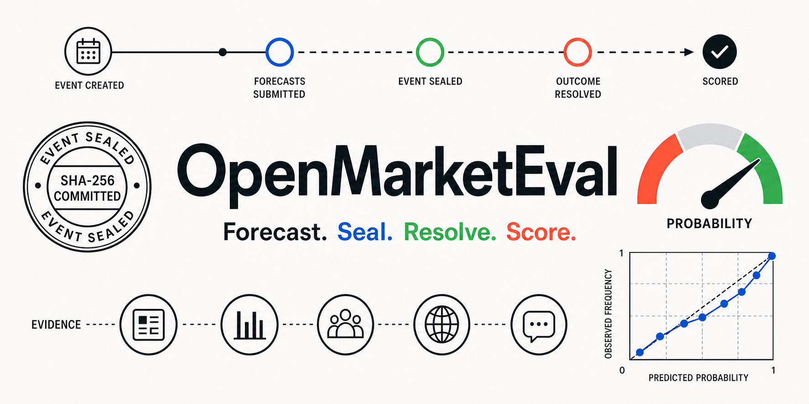
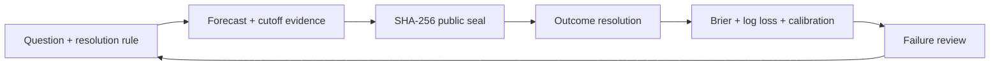

# OpenMarketEval

[](https://github.com/Alfonsobang/open-market-eval/actions/workflows/ci.yml)
[](live/rounds/2026-08/README.md)
[](LICENSE)
[](pyproject.toml)

**Can an AI assign 70% before a market-moving event, prove what it knew at the time, and remain calibrated after 100 calls?**

OpenMarketEval is an open evaluation harness for **stock-market and major-event forecasting agents**. It turns forecasts into timestamped, evidence-grounded artifacts, seals them before outcomes are known, then resolves and scores every hit and miss.

Use it to run any model or research agent through a one-file protocol, submit forecasts by pull request, and compare calibration after official results arrive.

[Live dashboard](https://alfonsobang.github.io/open-market-eval/) | [Open forecast round](live/rounds/2026-08/README.md) | [中文文档](README.zh-CN.md) | [Protocol](docs/protocol.md) | [Roadmap](docs/roadmap.md)



## One-minute demo

No API key, market data, or dependencies are required:

```bash
git clone https://github.com/Alfonsobang/open-market-eval.git
cd open-market-eval
python -m open_market_eval demo
```

```text
Validated 6 time-safe forecasts
Seal: <sha256>...
Mean Brier: 0.1129
Skill vs 0.5: 54.8%
Report: runs/demo/scorecard.md
```

The included probabilities are a **synthetic software fixture**, not claimed forecasting performance. The demo proves the evaluation loop works end to end.

## Live round: 2026-08

The first L2 round is open with six time-bound questions covering U.S. employment, CPI, GDP, the ECB, and the FOMC. Every question has a primary-source resolution rule and a committed 0.5 baseline.

- Browse deadlines on the [live dashboard](https://alfonsobang.github.io/open-market-eval/).
- Read the [round policy and submission steps](live/rounds/2026-08/README.md).
- Inspect the committed [`seal.json`](live/rounds/2026-08/seal.json).

Create a PR-ready submission with one command (your adapter reads JSON from stdin and writes JSON to stdout):

```bash
python -m open_market_eval prepare-submission \
  --questions live/rounds/2026-08/questions.jsonl \
  --command "python path/to/your_agent.py" \
  --forecaster your-agent-name \
  --output-dir live/rounds/2026-08/submissions/your-github-handle
```

The command skips closed questions, validates temporal integrity, and creates `forecasts.jsonl` plus `seal.json`. Pull requests are checked by the live-submission workflow. See the [adapter contract](docs/agent-adapter.md) for a minimal implementation.

The baseline is deliberately uninformative and makes no event-specific claim. Its purpose is to verify the L2 submission and scoring path before outcomes are known.

## What is different

Most market-prediction demos show an appealing answer or a backtest. OpenMarketEval makes the difficult parts inspectable:

| Failure mode | OpenMarketEval control |
| --- | --- |
| Hindsight leakage | Reject forecasts and evidence created after cutoff |
| Mutable predictions | SHA-256 seal for committed ledgers |
| Vague event labels | Predeclared binary criteria and resolution sources |
| Overconfident agents | Brier score, log loss, and calibration diagnostics |
| Weak comparisons | Skill versus an explicit baseline |
| Cherry-picked wins | Scorecard includes every matched resolved forecast |
| Framework lock-in | JSONL files and JSON-over-stdio agent protocol |

The Brier score is a proper scoring rule for probabilistic predictions; lower is better. See the [scikit-learn model evaluation guide](https://scikit-learn.org/stable/modules/model_evaluation.html#brier-score-loss) for background.

## Closed-loop architecture



## Use your own agent

An adapter reads one question as JSON from stdin and returns at least a probability as JSON on stdout.

```bash
python -m open_market_eval run-agent \
  --questions benchmarks/synthetic-smoke/questions.jsonl \
  --command "python examples/agents/base_rate.py" \
  --forecaster my-agent \
  --output runs/my-agent.jsonl
```

Then validate, seal, and score:

```bash
python -m open_market_eval validate \
  --questions benchmarks/synthetic-smoke/questions.jsonl \
  --forecasts runs/my-agent.jsonl

python -m open_market_eval seal \
  benchmarks/synthetic-smoke/questions.jsonl runs/my-agent.jsonl \
  --output runs/my-agent-seal.json

python -m open_market_eval score \
  --forecasts runs/my-agent.jsonl \
  --resolutions benchmarks/synthetic-smoke/resolutions.jsonl \
  --output runs/my-agent-scorecard.json
```

## Included today

- **Evaluation harness:** schema and temporal-integrity validation, sealing, resolution, and scoring.
- **Smoke benchmark:** six deterministic synthetic events spanning equities, macro, earnings, regulation, supply chains, and geopolitics.
- **Agent contract:** dependency-free JSON-over-stdio runner for any language or model stack.
- **Portable schemas:** JSON Schema contracts for questions, forecasts, and resolutions in [`schemas/`](schemas/).
- **Harbor task:** a small time-safe forecasting task with a deterministic verifier in [`integrations/harbor`](integrations/harbor/README.md).
- **Codex skill:** reusable workflow and output contract in [`skills/forecast-market-events`](skills/forecast-market-events/SKILL.md).
- **CI:** tests on Python 3.10 and 3.12, live-seal verification, skill validation, and Markdown link checks.
- **Public dashboard:** a dependency-free static Pages build with live deadlines and a clearly labeled synthetic scorecard.

## Evaluation tracks

| Track | Example question | Primary evaluation |
| --- | --- | --- |
| Equity event | Earnings beat, index threshold, corporate action | Probability accuracy + cutoff discipline |
| Macro | Rate decision, inflation threshold, policy release | Calibration + source quality |
| Regulation | Filing approval or rule deadline | Resolution clarity + evidence timing |
| Geopolitics | Signed agreement or announced restriction | Scenario coverage + calibration |
| Supply chain | Production halt or delivery threshold | Evidence quality + event resolution |
| Research agent | Search, synthesis, tool use, final forecast | Trace quality + final probabilistic score |

## Integrity levels

- **L0 synthetic smoke:** verifies code only.
- **L1 frozen pastcast:** reproducible historical research, with model-contamination caveats.
- **L2 live sealed:** prediction committed before the event closes.
- **L3 replicated live:** independently timestamped, reviewed, and repeated.

Only L2 and L3 should be used to make claims about live forecasting performance.

## Contributing

Useful contributions include public question packs, frozen evidence bundles, scoring diagnostics, agent adapters, Harbor tasks, and resolution reviews. Start with [CONTRIBUTING.md](CONTRIBUTING.md) or use the structured issue templates.

The near-term target is a 30-question public pack and a recurring live sealed round. See [the roadmap](docs/roadmap.md).

## Responsible use

OpenMarketEval evaluates research processes. It does not execute trades, recommend securities, provide price targets, or claim market-beating performance. Synthetic fixtures must never be presented as live results.

**This repository does not contain private company data, real user data, or proprietary workflows.**

Nothing in this repository is investment advice.
