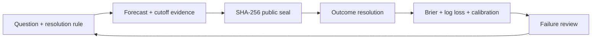

# OpenMarketEval

[](https://github.com/Alfonsobang/open-market-eval/actions/workflows/ci.yml)
[](live/rounds/2026-08/README.md)
[](LICENSE)
[](pyproject.toml)

## A-Share Research Quality Gate + Agent Arena

**Audit the backtest before trusting the return. Audit the Agent before trusting the research.**

OpenMarketEval is an open quality gate and public test arena for A-share research. It gives practitioners three workflows they can use today:

1. **Backtest Preflight:** inspect eight A-share research-design risks in the browser or CI, without uploading strategy code or data.
2. **Evidence Audit:** inspect financial-search packets for cutoff leakage, broken citations, mutable evidence, duplicate sources, and missing primary sources.
3. **Backtest Forensics:** run any Agent against 10 adversarial cases with clean controls and deterministic precision, recall, F1, and exact-case scoring.

[Audit a backtest](https://alfonsobang.github.io/open-market-eval/#preflight) | [Audit research evidence](https://alfonsobang.github.io/open-market-eval/research-audit.html) | [Run the Agent challenge](benchmarks/a-share-backtest-forensics/README.md) | [中文文档](README.zh-CN.md)


```bash
git clone https://github.com/Alfonsobang/open-market-eval.git
cd open-market-eval
python -m open_market_eval doctor --output runs/doctor.json
python -m open_market_eval audit-spec \
  --spec examples/backtests/leaky-a-share-contract.json \
  --output runs/my-preflight.json
```

`doctor` verifies all five bundled integrity paths offline: the forecast loop, backtest gate, evidence gate, three Harbor tasks, and the live-round seal. The audit command then produces machine-readable JSON and a review-ready Markdown report. The included risky contract triggers all eight checks; the conservative contract passes. Neither fixture contains a strategy, market data, or performance claim.

## Backtest Preflight

Declare research assumptions once in the portable [`backtest-contract.schema.json`](schemas/backtest-contract.schema.json), then make the audit a CI gate:

```bash
python -m open_market_eval audit-spec \
  --spec examples/backtests/conservative-a-share-contract.json \
  --strict
```

The current checks cover signal/fill timing, point-in-time universes, delisted names, executable prices, T+1 settlement, suspensions and price limits, transaction costs, and fundamental-data revisions. A pass means only that the declared configuration avoided these static defects; it does not validate code, data, returns, or investment merit.

[Join the beta](docs/backtest-preflight-beta.md) or [report a false positive, missed risk, or vocabulary gap](https://github.com/Alfonsobang/open-market-eval/issues/new?template=preflight-feedback.yml).

## Research Evidence Audit

Freeze a financial-search packet, connect every claim to evidence IDs, then inspect six provenance failures before review:

```bash
python -m open_market_eval audit-research-packet \
  --packet examples/research-packets/leaky-packet.json \
  --output runs/research-packet-audit.json
```

The command writes JSON and Markdown reports. The [browser workbench](https://alfonsobang.github.io/open-market-eval/research-audit.html) performs the same failure-class checks locally without uploading the packet. Read the [method and packet contract](docs/research-evidence-audit.md).

[Join the evidence-audit beta](docs/research-evidence-beta.md) with a false positive, missed risk, schema gap, or sanitized packet.

## Challenge 0: Backtest Forensics

| What is tested | Example failure | Score signal |
| --- | --- | --- |
| Temporal integrity | Signal formed after the claimed fill | Recall + evidence |
| Universe integrity | Today's constituents projected into history | Recall + exact case |
| Executability | Limit-up or suspended orders filled in full | Recall + evidence |
| A-share settlement | Same-day sale of a newly purchased cash-equity position | Recall + evidence |
| False-positive control | A conservative, point-in-time-safe setup | Precision |

```bash
python -m open_market_eval run-audit-agent \
  --command "python path/to/your_auditor.py" \
  --agent-name my-agent \
  --output-dir runs/my-agent
```

The harness sends one case at a time as JSON over stdin, captures the Agent's findings from stdout, and writes the submission, run metadata, JSON scorecard, and Markdown report. See the [audit Agent adapter contract](docs/audit-agent-adapter.md).

Public Agent rankings are currently empty. The first accepted result must disclose the Agent, model, exact command, environment, raw output, and complete scorecard. Development-pack scores are never presented as hidden-test rankings or investment performance.

## One-minute demo

No API key, market data, or dependencies are required:

```bash
git clone https://github.com/Alfonsobang/open-market-eval.git
cd open-market-eval
python -m open_market_eval demo
```

```text
Validated 6 time-safe forecasts
Seal: <sha256>...
Mean Brier: 0.1129
Skill vs 0.5: 54.8%
Report: runs/demo/scorecard.md
```

The included probabilities are a **synthetic software fixture**, not claimed forecasting performance. The demo proves the evaluation loop works end to end.

## Live round: 2026-08

The first L2 round is open with six time-bound questions covering U.S. employment, CPI, GDP, the ECB, and the FOMC. Every question has a primary-source resolution rule and a committed 0.5 baseline.

- Browse deadlines on the [live dashboard](https://alfonsobang.github.io/open-market-eval/).
- Read the [round policy and submission steps](live/rounds/2026-08/README.md).
- Inspect the committed [`seal.json`](live/rounds/2026-08/seal.json).

Create a PR-ready submission with one command (your adapter reads JSON from stdin and writes JSON to stdout):

```bash
python -m open_market_eval prepare-submission \
  --questions live/rounds/2026-08/questions.jsonl \
  --command "python path/to/your_agent.py" \
  --forecaster your-agent-name \
  --output-dir live/rounds/2026-08/submissions/your-github-handle
```

The command skips closed questions, validates temporal integrity, and creates `forecasts.jsonl` plus `seal.json`. Pull requests are checked by the live-submission workflow. See the [adapter contract](docs/agent-adapter.md) for a minimal implementation.

The baseline is deliberately uninformative and makes no event-specific claim. Its purpose is to verify the L2 submission and scoring path before outcomes are known.

## What is different

Most market-prediction demos show an appealing answer or a backtest. OpenMarketEval makes the difficult parts inspectable:

| Failure mode | OpenMarketEval control |
| --- | --- |
| Hindsight leakage | Reject forecasts and evidence created after cutoff |
| Mutable predictions | SHA-256 seal for committed ledgers |
| Vague event labels | Predeclared binary criteria and resolution sources |
| Overconfident agents | Brier score, log loss, and calibration diagnostics |
| Weak comparisons | Skill versus an explicit baseline |
| Cherry-picked wins | Scorecard includes every matched resolved forecast |
| Framework lock-in | JSONL files and JSON-over-stdio agent protocol |

The Brier score is a proper scoring rule for probabilistic predictions; lower is better. See the [scikit-learn model evaluation guide](https://scikit-learn.org/stable/modules/model_evaluation.html#brier-score-loss) for background.

## Closed-loop architecture



## Use your own agent

An adapter reads one question as JSON from stdin and returns at least a probability as JSON on stdout.

```bash
python -m open_market_eval run-agent \
  --questions benchmarks/synthetic-smoke/questions.jsonl \
  --command "python examples/agents/base_rate.py" \
  --forecaster my-agent \
  --output runs/my-agent.jsonl
```

Then validate, seal, and score:

```bash
python -m open_market_eval validate \
  --questions benchmarks/synthetic-smoke/questions.jsonl \
  --forecasts runs/my-agent.jsonl

python -m open_market_eval seal \
  benchmarks/synthetic-smoke/questions.jsonl runs/my-agent.jsonl \
  --output runs/my-agent-seal.json

python -m open_market_eval score \
  --forecasts runs/my-agent.jsonl \
  --resolutions benchmarks/synthetic-smoke/resolutions.jsonl \
  --output runs/my-agent-scorecard.json
```

## Included today

- **Evaluation harness:** schema and temporal-integrity validation, sealing, resolution, and scoring.
- **Backtest quality gate:** an eight-check contract linter for A-share research assumptions, with browser and CI entry points.
- **Research evidence gate:** a six-class financial-search packet audit for cutoffs, citations, source seals, primary evidence, and deduplication.
- **Smoke benchmark:** six deterministic synthetic events spanning equities, macro, earnings, regulation, supply chains, and geopolitics.
- **Agent contract:** dependency-free JSON-over-stdio runner for any language or model stack.
- **Portable schemas:** JSON Schema contracts for questions, forecasts, resolutions, backtests, and evidence packets in [`schemas/`](schemas/).
- **Harbor tasks:** three schema 1.3 tasks for time-safe forecasting, financial-search evidence, and A-share backtest audit, with deterministic verifiers in [`integrations/harbor`](integrations/harbor/README.md).
- **Codex skill:** reusable workflow and output contract in [`skills/forecast-market-events`](skills/forecast-market-events/SKILL.md).
- **CI:** tests on Python 3.10 and 3.12, live-seal verification, skill validation, and Markdown link checks.
- **Public dashboard:** a dependency-free static Pages build with live deadlines and a clearly labeled synthetic scorecard.

## Evaluation tracks

| Track | Example question | Primary evaluation |
| --- | --- | --- |
| Equity event | Earnings beat, index threshold, corporate action | Probability accuracy + cutoff discipline |
| Macro | Rate decision, inflation threshold, policy release | Calibration + source quality |
| Regulation | Filing approval or rule deadline | Resolution clarity + evidence timing |
| Geopolitics | Signed agreement or announced restriction | Scenario coverage + calibration |
| Supply chain | Production halt or delivery threshold | Evidence quality + event resolution |
| Research agent | Search, synthesis, tool use, final forecast | Trace quality + final probabilistic score |

## Integrity levels

- **L0 synthetic smoke:** verifies code only.
- **L1 frozen pastcast:** reproducible historical research, with model-contamination caveats.
- **L2 live sealed:** prediction committed before the event closes.
- **L3 replicated live:** independently timestamped, reviewed, and repeated.

Only L2 and L3 should be used to make claims about live forecasting performance.

## Contributing

Useful contributions include public question packs, frozen evidence bundles, scoring diagnostics, agent adapters, Harbor tasks, and resolution reviews. Start with [CONTRIBUTING.md](CONTRIBUTING.md) or use the structured issue templates.

The near-term target is a 30-question public pack and a recurring live sealed round. See [the roadmap](docs/roadmap.md).

## Responsible use

OpenMarketEval evaluates research processes. It does not execute trades, recommend securities, provide price targets, or claim market-beating performance. Synthetic fixtures must never be presented as live results.

**This repository does not contain private company data, real user data, or proprietary workflows.**

Nothing in this repository is investment advice.
