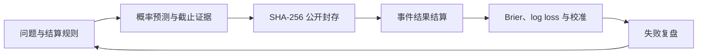

# OpenMarketEval

[](https://github.com/Alfonsobang/open-market-eval/actions/workflows/ci.yml)
[](live/rounds/2026-08/README.md)
[](LICENSE)
[](pyproject.toml)

## A 股研究质量门禁 + Agent 试验场

**先审计回测，再相信收益；先测试 Agent，再相信研究结论。**

OpenMarketEval 是面向 A 股研究的开源质量门禁与公共试验场。它首先提供四条可以直接运行的工作流：

1. **Backtest Preflight / 回测体检：** 在浏览器或 CI 中检查 8 类 A 股研究设计风险，不需要上传策略代码和数据。
2. **Evidence Audit / 证据审计：** 检查金融搜索证据包中的截止时点泄漏、断裂引用、可变证据、重复来源与一手来源缺失。
3. **Point-in-Time Filing QA / 时点查数：** 用 5 份 A 股官方年报中的 10 个事实，测试数值提取、单位、归一化、页码引用与来源追溯。
4. **Backtest Forensics / 回测取证：** 让任意 Agent 挑战 10 个对抗场景，通过干净控制组和确定性评分器计算精确率、召回率、F1 与逐案命中率。

[在线体检回测](https://alfonsobang.github.io/open-market-eval/#preflight) | [审计研究证据](https://alfonsobang.github.io/open-market-eval/research-audit.html) | [运行时点查数](https://alfonsobang.github.io/open-market-eval/filing-qa.html) | [运行 Agent 挑战](benchmarks/a-share-backtest-forensics/README.md) | [English](README.md)


```bash
git clone https://github.com/Alfonsobang/open-market-eval.git
cd open-market-eval
python -m open_market_eval doctor --output runs/doctor.json
python -m open_market_eval audit-spec \
  --spec examples/backtests/leaky-a-share-contract.json \
  --output runs/my-preflight.json
```

`doctor` 会离线验证六条内置完整性路径：预测闭环、回测门禁、证据门禁、时点查数开发集、四项 Harbor 任务以及实时轮次封存。CI 会把机器可读结果发布为 `project-integrity-report` 构建产物。随后，审计命令会生成 JSON 和便于评审的 Markdown 报告。高风险样例会触发全部 8 项检查，保守样例可以通过。两个样例均不包含策略、行情数据或收益声明。

## Backtest Preflight / 回测体检

使用可移植的 [`backtest-contract.schema.json`](schemas/backtest-contract.schema.json) 声明研究假设，再把检查设为 CI 门禁：

```bash
python -m open_market_eval audit-spec \
  --spec examples/backtests/conservative-a-share-contract.json \
  --strict
```

当前检查覆盖信号与成交时点、历史时点股票池、退市样本、可成交价格、T+1、停牌与涨跌停、交易成本以及财务数据修订。通过检查只表示已声明的配置没有触发这 8 类静态缺陷，并不代表代码、数据、收益或投资逻辑已经被验证。

[参加 beta](docs/backtest-preflight-beta.md)，或通过[结构化表单反馈误报、漏报与合同表达缺口](https://github.com/Alfonsobang/open-market-eval/issues/new?template=preflight-feedback.yml)。

## Research Evidence Audit / 研究证据审计

先冻结金融搜索证据包，把每条主张连接到明确的证据 ID，再在进入评审前检查六类来源链路问题：

```bash
python -m open_market_eval audit-research-packet \
  --packet examples/research-packets/leaky-packet.json \
  --output runs/research-packet-audit.json
```

命令会生成 JSON 与 Markdown 报告。[浏览器工作台](https://alfonsobang.github.io/open-market-eval/research-audit.html)会在本地执行相同类别的检查，不上传证据包。详细方法与字段协议见[中文文档](docs/research-evidence-audit.zh-CN.md)。

欢迎通过[证据审计 beta](docs/research-evidence-beta.md)提交误报、漏报、schema 缺口或经过脱敏的研究包。

## Point-in-Time Filing QA / 时点查数

金融 Agent 经常在看似简单的细节上失败：使用错误版本的报告、把单位放大或缩小 1,000 倍、用母公司口径替代合并口径，或者把报告印刷页码误当成 PDF 物理页码。公开开发集把这些问题变成可以精确评分的输出协议：

```bash
python -m open_market_eval score-fact-qa \
  --submission path/to/fact-answers.jsonl \
  --output runs/fact-qa-scorecard.json
```

开发集包含 5 份官方 2024 年年度报告中的 10 道任务，并记录来源链接、公告截止日期、文件字节数、SHA-256、公开标签与逐字段诊断。PDF 只提供链接，不在仓库中再次分发。可使用[浏览器实验室](https://alfonsobang.github.io/open-market-eval/filing-qa.html)、阅读[中文评测卡](benchmarks/a-share-point-in-time-qa/README.zh-CN.md)、运行 [Harbor 任务](integrations/harbor/a-share-point-in-time-qa)，或用公开证据[挑战现有标签](https://github.com/Alfonsobang/open-market-eval/issues/new?template=fact-qa-feedback.yml)。

## 首关：Backtest Forensics

| 验证什么 | 典型错误 | 评分信号 |
| --- | --- | --- |
| 时间完整性 | 信号晚于声称的成交价格 | 召回率 + 证据 |
| 股票池完整性 | 用今天的成分股回放历史 | 召回率 + 逐案命中 |
| 可成交性 | 涨停或停牌订单仍全部成交 | 召回率 + 证据 |
| A 股交收约束 | 新买入现货仓位当日卖出 | 召回率 + 证据 |
| 误报控制 | 时点安全、执行保守的干净场景 | 精确率 |

```bash
python -m open_market_eval run-audit-agent \
  --command "python path/to/your_auditor.py" \
  --agent-name my-agent \
  --output-dir runs/my-agent
```

harness 会逐案通过 stdin 发送 JSON，从 stdout 收集 Agent 的缺陷判断，并生成原始提交、运行元数据、JSON 成绩单和 Markdown 报告。接入方式见 [审计 Agent 适配协议](docs/audit-agent-adapter.md)。

公开 Agent 榜目前为空。首个被接受的成绩必须披露 Agent、模型、完整命令、运行环境、原始输出和完整成绩单。开发集成绩不会被包装成隐藏测试榜单或投资业绩。

## 一分钟运行

不需要 API Key、行情数据或第三方依赖：

```bash
git clone https://github.com/Alfonsobang/open-market-eval.git
cd open-market-eval
python -m open_market_eval demo
```

```text
Validated 6 time-safe forecasts
Seal: <sha256>...
Mean Brier: 0.1129
Skill vs 0.5: 54.8%
Report: runs/demo/scorecard.md
```

仓库中的概率是用于测试软件的**合成样例**，不代表真实预测业绩。这个 demo 只证明评测闭环可以端到端运行。

## 实时轮次：2026-08

首个 L2 轮次已经开放，包含 6 个有明确截止时间的问题，覆盖美国就业、CPI、GDP、欧洲央行和美联储。每个问题都有官方结算来源，并提交了一个已封存的 0.5 基线。

- 在[实时看板](https://alfonsobang.github.io/open-market-eval/)查看问题和截止时间。
- 阅读[轮次规则与提交步骤](live/rounds/2026-08/README.md)。
- 检查已经提交的 [`seal.json`](live/rounds/2026-08/seal.json)。

只需一条命令即可生成可提交的预测文件（你的适配器从 stdin 读取 JSON，并向 stdout 输出 JSON）：

```bash
python -m open_market_eval prepare-submission \
  --questions live/rounds/2026-08/questions.jsonl \
  --command "python path/to/your_agent.py" \
  --forecaster your-agent-name \
  --output-dir live/rounds/2026-08/submissions/your-github-handle
```

该命令会跳过已截止问题，检查时间完整性，并生成 `forecasts.jsonl` 与 `seal.json`。Pull Request 会由 live-submission workflow 自动验真。最小实现参见 [Agent 适配协议](docs/agent-adapter.md)。

这个 0.5 基线刻意不使用任何事件信息，也不表达具体判断；它只用于在结果揭晓前验证 L2 提交、封存和后续评分流程。

## 项目解决什么问题

很多市场预测项目只展示一个看起来不错的答案或一段回测。OpenMarketEval 把最容易被忽略的部分变成可检查的工程约束：

| 常见问题 | OpenMarketEval 的控制机制 |
| --- | --- |
| 偷看未来信息 | 拒绝截止时间后创建的预测和证据 |
| 事后修改观点 | 对问题和预测账本生成 SHA-256 封存记录 |
| 事件定义含糊 | 预先声明二元结算规则与结算来源 |
| 模型过度自信 | Brier 分数、log loss 与校准诊断 |
| 对比基线过弱 | 明确报告相对基线的预测 skill |
| 只展示成功案例 | 评分卡纳入所有已匹配、已结算的预测 |
| 绑定单一框架 | 使用 JSONL 文件和 JSON-over-stdio Agent 协议 |

Brier 分数是概率预测常用的 proper scoring rule，越低越好。背景知识可参考 [scikit-learn 模型评测文档](https://scikit-learn.org/stable/modules/model_evaluation.html#brier-score-loss)。

## 验证闭环



## 接入你自己的 Agent

适配器从 stdin 读取一个 JSON 问题，并在 stdout 返回 JSON，至少要包含概率字段。

```bash
python -m open_market_eval run-agent \
  --questions benchmarks/synthetic-smoke/questions.jsonl \
  --command "python examples/agents/base_rate.py" \
  --forecaster my-agent \
  --output runs/my-agent.jsonl
```

随后依次完成校验、封存与评分：

```bash
python -m open_market_eval validate \
  --questions benchmarks/synthetic-smoke/questions.jsonl \
  --forecasts runs/my-agent.jsonl

python -m open_market_eval seal \
  benchmarks/synthetic-smoke/questions.jsonl runs/my-agent.jsonl \
  --output runs/my-agent-seal.json

python -m open_market_eval score \
  --forecasts runs/my-agent.jsonl \
  --resolutions benchmarks/synthetic-smoke/resolutions.jsonl \
  --output runs/my-agent-scorecard.json
```

## 当前已经包含

- **评测 harness：** 数据结构与时点完整性校验、封存、结算和评分。
- **回测质量门禁：** 面向 A 股研究假设的 8 项合同检查，可在浏览器与 CI 中运行。
- **研究证据门禁：** 面向金融搜索证据包的六类检查，覆盖截止时点、引用、内容封存、一手来源与去重。
- **时点查数开发集：** 5 份官方年报中的 10 个公开事实，逐项评分数值、单位、归一化、期间、口径、PDF 页码与来源 ID。
- **Smoke 评测集：** 6 个确定性的合成事件，覆盖权益、宏观、财报、监管、供应链和地缘事件。
- **Agent 协议：** 无第三方依赖的 JSON-over-stdio runner，可接入任意语言和模型栈。
- **可移植数据协议：** [`schemas/`](schemas/) 中包含问题、预测、结算、回测合同与研究证据包的 JSON Schema。
- **Harbor 任务：** [`integrations/harbor`](integrations/harbor/README.md) 中包含四个符合 schema 1.3 的任务，分别评测时点安全预测、时点查数、金融搜索证据与 A 股回测审计，并配有确定性 verifier。
- **Codex skill：** [`skills/forecast-market-events`](skills/forecast-market-events/SKILL.md) 中包含可复用的预测工作流与输出协议。
- **CI：** Python 3.10/3.12 测试、实时封存校验、skill 校验和 Markdown 链接检查。
- **公开看板：** 无第三方前端依赖的 GitHub Pages 页面，展示实时截止时间和明确标注为合成数据的评分卡。

## 评测方向

| 方向 | 问题示例 | 主要评测点 |
| --- | --- | --- |
| 权益事件 | 财报超预期、指数阈值、公司行动 | 概率准确性与截止纪律 |
| 宏观事件 | 利率决议、通胀阈值、政策发布 | 校准度与来源质量 |
| 监管事件 | 申请获批或规则生效期限 | 结算清晰度与证据时点 |
| 地缘事件 | 协议签署或限制措施公布 | 情景覆盖与校准度 |
| 供应链事件 | 停产或交付阈值 | 证据质量与事件结算 |
| 研究 Agent | 搜索、综合、工具调用、最终预测 | 轨迹质量与概率评分 |

## 完整性等级

- **L0 合成 smoke：** 只验证代码行为。
- **L1 冻结 pastcast：** 可复现的历史研究，但必须说明模型训练数据污染风险。
- **L2 实时封存：** 在事件关闭前提交并封存预测。
- **L3 可复核实时评测：** 预测有独立时间戳、结算审核和重复样本。

只有 L2 和 L3 适合用于陈述真实预测表现。

## 参与贡献

高价值贡献包括公开问题集、冻结证据包、评分诊断、Agent adapter、Harbor 任务与结算审核。请先阅读 [CONTRIBUTING.md](CONTRIBUTING.md)，也可以直接使用结构化 issue 模板。

近期目标是发布包含 30 个问题的公开评测包，并启动周期性的实时封存轮次。详情见[路线图](docs/roadmap.md)。

## 负责任使用

OpenMarketEval 评测的是研究过程。它不执行交易、不推荐证券、不提供目标价，也不声称能够获得超额收益。合成样例不得被包装成真实预测结果。

**本仓库不包含任何公司私有数据、真实用户数据或专有工作流。**

本仓库的任何内容均不构成投资建议。
