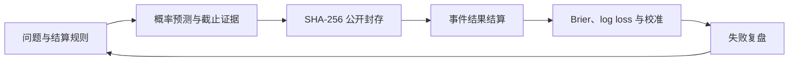

# OpenMarketEval

[](https://github.com/Alfonsobang/open-market-eval/actions/workflows/ci.yml)
[](live/rounds/2026-08/README.md)
[](LICENSE)
[](pyproject.toml)

**一个 AI 能否在市场重大事件发生前给出 70% 的概率，证明当时掌握了哪些信息，并在 100 次预测后仍然保持良好校准？**

OpenMarketEval 是面向**股市与重大事件预测 Agent** 的开放评测框架。它把预测变成带时间戳、可核查证据的研究产物，在结果揭晓前完成封存，并在事件结束后结算和评分，命中与失误都会保留。

你可以通过一个文件协议接入任意模型或研究 Agent，以 Pull Request 提交预测，并在官方结果发布后比较校准表现。

[实时看板](https://alfonsobang.github.io/open-market-eval/) | [开放预测轮次](live/rounds/2026-08/README.md) | [English](README.md) | [预测协议](docs/protocol.md) | [路线图](docs/roadmap.md)


## 一分钟运行

不需要 API Key、行情数据或第三方依赖：

```bash
git clone https://github.com/Alfonsobang/open-market-eval.git
cd open-market-eval
python -m open_market_eval demo
```

```text
Validated 6 time-safe forecasts
Seal: <sha256>...
Mean Brier: 0.1129
Skill vs 0.5: 54.8%
Report: runs/demo/scorecard.md
```

仓库中的概率是用于测试软件的**合成样例**，不代表真实预测业绩。这个 demo 只证明评测闭环可以端到端运行。

## 实时轮次：2026-08

首个 L2 轮次已经开放，包含 6 个有明确截止时间的问题，覆盖美国就业、CPI、GDP、欧洲央行和美联储。每个问题都有官方结算来源，并提交了一个已封存的 0.5 基线。

- 在[实时看板](https://alfonsobang.github.io/open-market-eval/)查看问题和截止时间。
- 阅读[轮次规则与提交步骤](live/rounds/2026-08/README.md)。
- 检查已经提交的 [`seal.json`](live/rounds/2026-08/seal.json)。

只需一条命令即可生成可提交的预测文件（你的适配器从 stdin 读取 JSON，并向 stdout 输出 JSON）：

```bash
python -m open_market_eval prepare-submission \
  --questions live/rounds/2026-08/questions.jsonl \
  --command "python path/to/your_agent.py" \
  --forecaster your-agent-name \
  --output-dir live/rounds/2026-08/submissions/your-github-handle
```

该命令会跳过已截止问题，检查时间完整性，并生成 `forecasts.jsonl` 与 `seal.json`。Pull Request 会由 live-submission workflow 自动验真。最小实现参见 [Agent 适配协议](docs/agent-adapter.md)。

这个 0.5 基线刻意不使用任何事件信息，也不表达具体判断；它只用于在结果揭晓前验证 L2 提交、封存和后续评分流程。

## 项目解决什么问题

很多市场预测项目只展示一个看起来不错的答案或一段回测。OpenMarketEval 把最容易被忽略的部分变成可检查的工程约束：

| 常见问题 | OpenMarketEval 的控制机制 |
| --- | --- |
| 偷看未来信息 | 拒绝截止时间后创建的预测和证据 |
| 事后修改观点 | 对问题和预测账本生成 SHA-256 封存记录 |
| 事件定义含糊 | 预先声明二元结算规则与结算来源 |
| 模型过度自信 | Brier 分数、log loss 与校准诊断 |
| 对比基线过弱 | 明确报告相对基线的预测 skill |
| 只展示成功案例 | 评分卡纳入所有已匹配、已结算的预测 |
| 绑定单一框架 | 使用 JSONL 文件和 JSON-over-stdio Agent 协议 |

Brier 分数是概率预测常用的 proper scoring rule，越低越好。背景知识可参考 [scikit-learn 模型评测文档](https://scikit-learn.org/stable/modules/model_evaluation.html#brier-score-loss)。

## 验证闭环



## 接入你自己的 Agent

适配器从 stdin 读取一个 JSON 问题，并在 stdout 返回 JSON，至少要包含概率字段。

```bash
python -m open_market_eval run-agent \
  --questions benchmarks/synthetic-smoke/questions.jsonl \
  --command "python examples/agents/base_rate.py" \
  --forecaster my-agent \
  --output runs/my-agent.jsonl
```

随后依次完成校验、封存与评分：

```bash
python -m open_market_eval validate \
  --questions benchmarks/synthetic-smoke/questions.jsonl \
  --forecasts runs/my-agent.jsonl

python -m open_market_eval seal \
  benchmarks/synthetic-smoke/questions.jsonl runs/my-agent.jsonl \
  --output runs/my-agent-seal.json

python -m open_market_eval score \
  --forecasts runs/my-agent.jsonl \
  --resolutions benchmarks/synthetic-smoke/resolutions.jsonl \
  --output runs/my-agent-scorecard.json
```

## 当前已经包含

- **评测 harness：** 数据结构与时点完整性校验、封存、结算和评分。
- **Smoke 评测集：** 6 个确定性的合成事件，覆盖权益、宏观、财报、监管、供应链和地缘事件。
- **Agent 协议：** 无第三方依赖的 JSON-over-stdio runner，可接入任意语言和模型栈。
- **可移植数据协议：** [`schemas/`](schemas/) 中包含问题、预测与结算的 JSON Schema。
- **Harbor 任务：** [`integrations/harbor`](integrations/harbor/README.md) 中包含一个带确定性 verifier 的时点安全预测任务。
- **Codex skill：** [`skills/forecast-market-events`](skills/forecast-market-events/SKILL.md) 中包含可复用的预测工作流与输出协议。
- **CI：** Python 3.10/3.12 测试、实时封存校验、skill 校验和 Markdown 链接检查。
- **公开看板：** 无第三方前端依赖的 GitHub Pages 页面，展示实时截止时间和明确标注为合成数据的评分卡。

## 评测方向

| 方向 | 问题示例 | 主要评测点 |
| --- | --- | --- |
| 权益事件 | 财报超预期、指数阈值、公司行动 | 概率准确性与截止纪律 |
| 宏观事件 | 利率决议、通胀阈值、政策发布 | 校准度与来源质量 |
| 监管事件 | 申请获批或规则生效期限 | 结算清晰度与证据时点 |
| 地缘事件 | 协议签署或限制措施公布 | 情景覆盖与校准度 |
| 供应链事件 | 停产或交付阈值 | 证据质量与事件结算 |
| 研究 Agent | 搜索、综合、工具调用、最终预测 | 轨迹质量与概率评分 |

## 完整性等级

- **L0 合成 smoke：** 只验证代码行为。
- **L1 冻结 pastcast：** 可复现的历史研究，但必须说明模型训练数据污染风险。
- **L2 实时封存：** 在事件关闭前提交并封存预测。
- **L3 可复核实时评测：** 预测有独立时间戳、结算审核和重复样本。

只有 L2 和 L3 适合用于陈述真实预测表现。

## 参与贡献

高价值贡献包括公开问题集、冻结证据包、评分诊断、Agent adapter、Harbor 任务与结算审核。请先阅读 [CONTRIBUTING.md](CONTRIBUTING.md)，也可以直接使用结构化 issue 模板。

近期目标是发布包含 30 个问题的公开评测包，并启动周期性的实时封存轮次。详情见[路线图](docs/roadmap.md)。

## 负责任使用

OpenMarketEval 评测的是研究过程。它不执行交易、不推荐证券、不提供目标价，也不声称能够获得超额收益。合成样例不得被包装成真实预测结果。

**本仓库不包含任何公司私有数据、真实用户数据或专有工作流。**

本仓库的任何内容均不构成投资建议。
